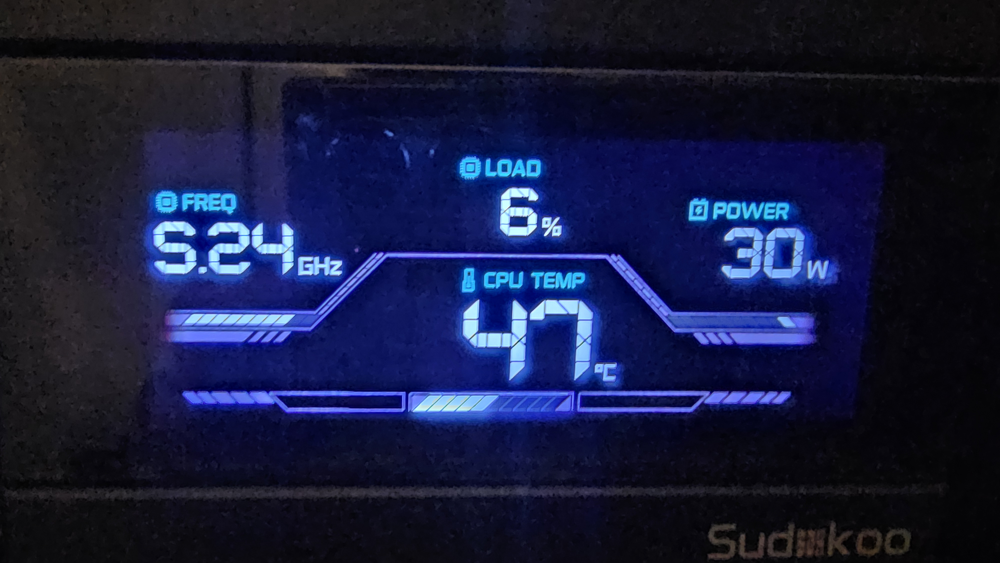

# SK700V Linux

Display live CPU stats (temperature, load, power, frequency) on the **Sudokoo SK700V**
CPU cooler's LCD screen — on Linux. A lightweight background service replacing the
Windows-only "MasterCraft" app.



The SK700V's display protocol was reverse-engineered from scratch (the device is
undocumented and Windows-only). The full protocol is documented in [PROTOCOL.md](PROTOCOL.md).

## Features

- Live CPU **temperature, load, package power, and peak frequency** on the cooler LCD
- Runs as a tiny background **systemd service** (~6 MB RAM), auto-starts on login
- Celsius / Fahrenheit toggle
- Adjustable update rate
- No root needed at runtime (uses udev rules)

## Requirements

- Linux (developed on Fedora; should work on any modern distro)
- Python 3.8+
- A Sudokoo SK700V cooler (USB ID `381c:0003`)

## Install

```bash
git clone https://github.com/YOURNAME/sk700v-linux.git
cd sk700v-linux
./install.sh
```

The installer sets up the Python package, the udev rules (HID access + CPU power),
and the systemd user service.

## Usage

The monitor runs automatically in the background after install. To control it:

```bash
sk700v status              # show device + current settings
sk700v unit F              # switch to Fahrenheit (then restart service)
sk700v unit C              # switch to Celsius
sk700v rate 0.5            # update interval in seconds (0.25-10)

systemctl --user restart sk700v   # apply a setting change
systemctl --user stop sk700v      # stop the monitor
journalctl --user -u sk700v -f    # view live logs
```

## Notes & limitations

- **Fahrenheit is hardware-capped at 127 °F** — the display's temperature field
  cannot show higher in any known mode. Celsius is full-range and recommended.
- Power readings use Intel RAPL (works on AMD Ryzen too); the udev rule grants
  read access without root.

## Credits

Protocol reverse-engineered by studying the device and the excellent prior work in
[Nortank12/deepcool-digital-linux](https://github.com/Nortank12/deepcool-digital-linux)
and related projects. Not affiliated with Sudokoo or DeepCool.

## Disclaimer

Unofficial software that writes to your hardware. Use at your own risk. Provided
as-is under the MIT License.

## License

MIT — see [LICENSE](LICENSE).
